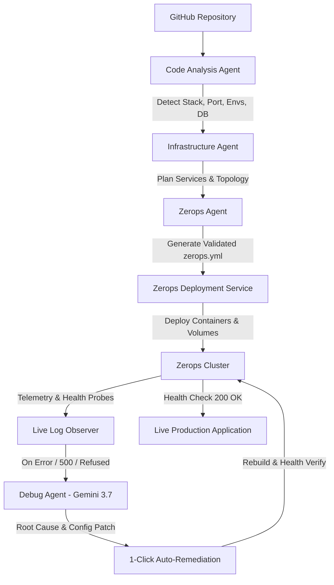

# DeployMate AI 🚀


### AI-Powered Intelligent Application Deployment & Troubleshooting Agent

> **Project:** Intelligent Multi-Agent Cloud Deployment Pipeline  
> **Repository:** [Tanya-garg10/DeployMate-AI](https://github.com/Tanya-garg10/DeployMate-AI)  
> **Infrastructure Platform:** [Zerops](https://zerops.io)

## 💡 Executive Summary & Core Idea

Deploying modern cloud applications across microservices, databases, and container runtimes remains error-prone and developer-intensive. Configuration drift, missing environment variables, port mismatches, and ambiguous runtime logs often cause deployments to fail at runtime.

**DeployMate AI** transforms cloud deployments into an autonomous, intelligent multi-agent pipeline:

$$\text{PLAN} \longrightarrow \text{ACT} \longrightarrow \text{OBSERVE} \longrightarrow \text{DIAGNOSE} \longrightarrow \text{RECOVER}$$

From analyzing public or private GitHub repositories to provisioning Zerops infrastructure, generating optimized `zerops.yml` specifications, streaming live container telemetry, and performing root-cause remediation, DeployMate AI delivers a production-grade experience for developers and DevOps engineers.

## 🏗 Multi-Agent Architecture



### Logical Agent Breakdown

1. **Code Analysis Agent** (`server/agents/code_analysis_agent.ts`)
   - Deeply inspects repository trees, `package.json`, `requirements.txt`, `pyproject.toml`, `.env.example`, `Dockerfile`, and configuration files.
   - Detects frameworks (FastAPI, Next.js, React/Vite, Node.js, Django, Flask), package managers (`pip`, `npm`, `pnpm`, `bun`), port mappings, and required environment variables.
   - Computes a deterministic confidence rating based on source-code ground truth combined with AI semantic code reasoning.

2. **Infrastructure Agent** (`server/agents/infrastructure_agent.ts`)
   - Designs multi-tier cloud topologies (Frontend, Backend API, Zerops Managed PostgreSQL / Redis).
   - Generates CPU, RAM, and scaling recommendations with DevOps justifications.

3. **Zerops Agent** (`server/agents/zerops_agent.ts`)
   - Generates valid, production-ready `zerops.yml` configurations with multi-stage build caching, deploy files, environment variables, and HTTP health check endpoints.

4. **Deployment & Telemetry Service** (`server/services/zerops_service.ts`)
   - Manages container lifecycle states: `QUEUED` → `BUILDING` → `DEPLOYING` → `RUNNING` / `FAILED` → `RECOVERING`.
   - Streams color-coded terminal logs and health probes.

5. **Debug Agent (Killer Feature)** (`server/agents/debug_agent.ts`)
   - Evaluates failed runtime logs, container exit codes, and architecture context using AI.
   - Identifies root causes (e.g. missing `DATABASE_URL`, `127.0.0.1` vs `0.0.0.0` ingress binding, missing package dependencies).
   - Formulates concrete configuration patches and triggers **1-Click Auto-Remediation**.

## ⚡ Tech Stack

- **Frontend:** React 19, TypeScript, Vite, Tailwind CSS, Lucide Icons, Motion, Canvas-Confetti
- **Backend:** Express & Node.js (Full-stack Server with tsx and Vite middleware)
- **AI Engine:** Google Gemini via `@google/genai`
- **Target Cloud Infrastructure:** [Zerops](https://zerops.io) (`zerops.yml`, Zerops API/CLI integration)
- **Database:** Zerops Managed PostgreSQL 16
- **Repository Integration:** GitHub REST API v3

## 🛠 Local Setup & Running

### Prerequisites
- Node.js >= 20.x
- Gemini API Key (`GEMINI_API_KEY`)

### 1. Installation
```bash
# Clone the repository
git clone https://github.com/Tanya-garg10/DeployMate-AI.git
cd DeployMate-AI

# Install Node dependencies
npm install
```

### 2. Environment Variables Configuration
Copy `.env.example` to `.env`:
```bash
cp .env.example .env
```
Populate `.env`:
```env
GEMINI_API_KEY="your-gemini-api-key"
ZEROPS_API_TOKEN=""      # Optional: Zerops API token for live deployments (defaults to simulation sandbox)
GITHUB_TOKEN=""          # Optional: GitHub token for higher API rate limits
```

### 3. Run Development Server
```bash
npm run dev
```
The application will be accessible at `http://localhost:3000`.

## � Project Structure

```
DeployMate-AI/
├── src/                          # Frontend React application
│   ├── components/               # UI components
│   │   ├── AiDiagnosisView.tsx
│   │   ├── DeploymentMonitor.tsx
│   │   ├── InfrastructurePlanner.tsx
│   │   ├── Navbar.tsx
│   │   └── ...
│   ├── services/                # API client services
│   ├── types.ts                  # TypeScript type definitions
│   └── main.tsx                  # Entry point
├── server/                       # Backend Node.js/Express server
│   ├── agents/                   # AI agents
│   │   ├── code_analysis_agent.ts
│   │   ├── debug_agent.ts
│   │   ├── infrastructure_agent.ts
│   │   └── zerops_agent.ts
│   ├── services/                 # Backend services
│   │   ├── ai_service.ts
│   │   ├── github_service.ts
│   │   └── zerops_service.ts
│   └── api/                      # API routes
│       └── routes.ts
├── backend/                      # Python FastAPI reference implementation
│   ├── main.py
│   ├── models/
│   └── requirements.txt
├── public/                       # Static assets
├── package.json                  # Node.js dependencies
├── tsconfig.json                 # TypeScript configuration
├── vite.config.ts                # Vite build configuration
└── zerops.yml                    # Zerops deployment configuration
```

---

## 🚀 Deployment Options

### Option 1: Render (Recommended - Free Tier)

DeployMate AI can be deployed to Render with free tier:

1. **Create Render account:** https://render.com
2. **Create new Web Service**
3. **Connect GitHub repository:** `Tanya-garg10/DeployMate-AI`
4. **Configure settings:**
   - Build Command: `npm run build`
   - Start Command: `npm start`
   - Environment Variables:
     - `GEMINI_API_KEY`: Your Gemini API key
     - `ZEROPS_API_TOKEN`: Optional
     - `GITHUB_TOKEN`: Optional
     - `NODE_ENV`: `production`
5. **Deploy** - Render will automatically detect the `render.yaml` configuration

### Option 2: Zerops Production Deployment

DeployMate AI includes pre-configured `zerops.yml` files for deploying directly to Zerops:

```yaml
zerops:
  - setup: app
    build:
      base: nodejs@20
      buildCommands:
        - npm ci
        - npm run build
      deployFiles:
        - dist
        - package.json
        - package-lock.json
        - node_modules
      cache:
        - node_modules
    run:
      base: nodejs@20
      ports:
        - port: 3000
          httpSupport: true
      envVariables:
        GEMINI_API_KEY: "${geminiApiKey}"
        ZEROPS_API_TOKEN: "${zeropsApiToken}"
        NODE_ENV: "production"
      start: node dist/server.cjs
      healthCheck:
        httpGet:
          port: 3000
          path: /health
```

## 📡 REST API Reference

| Endpoint | Method | Description |
|---|---|---|
| `/health` | `GET` | Health check endpoint returning `{ status: "healthy", service: "DeployMate AI" }` |
| `/api/analyze` | `POST` | Inspects GitHub repository files, framework, language, dependencies, and environment variables |
| `/api/generate-plan` | `POST` | Infrastructure Agent creates multi-tier Zerops service topology |
| `/api/generate-config` | `POST` | Zerops Agent generates validated `zerops.yml` |
| `/api/deploy` | `POST` | Triggers container build and deployment pipeline |
| `/api/deployments` | `GET` | Lists all historical and active deployments |
| `/api/deployments/:id` | `GET` | Retrieves deployment status, timeline, and metadata |
| `/api/deployments/:id/logs` | `GET` | Streams console terminal logs |
| `/api/deployments/:id/diagnose`| `POST` | Triggers AI Debug Agent to diagnose root-cause on failed deployment |
| `/api/deployments/:id/apply-fix`| `POST` | Applies AI recommended fix, patches config, and executes auto-redeploy |

## 🎯 Demo Workflow

To verify the complete functionality:

1. **Launch App**: Open the dashboard at `http://localhost:3000`.
2. **Select Repository**: Click the preset `DeployMate AI (Hackathon Project)` or paste any GitHub repository URL.
3. **Analyze**: Click **[ Analyze Project ]**. The **Code Analysis Agent** will inspect the repository, detect the tech stack, ports, and environment variables.
4. **Generate Plan**: Click **[ Generate Zerops Topology ]**. Review the visual topology graph and the generated `zerops.yml` configuration.
5. **Deploy**: Click **[ Deploy to Zerops ]** to start the deployment process.
6. **Monitor**: Watch the real-time deployment logs and health checks in the deployment monitor.
7. **Debug (if needed)**: If deployment fails, click **[ View AI Diagnosis ]** to get root cause analysis and auto-fix suggestions.
8. **Auto-Remediate**: Click **[ Apply Fix & Redeploy ]** to automatically apply the suggested fixes and redeploy.

## 🔒 Security & Best Practices

- **Zero Client-Side Secrets**: All Gemini API keys, GitHub tokens, and Zerops credentials remain strictly server-side.
- **Safe Command Safeguards**: No arbitrary shell command injection is allowed.
- **Explicit Mode Indicator**: The UI strictly separates Live Zerops deployments from Simulated Test Sandboxes.

## 🌟 Future Scope

- Direct Webhook integration with GitHub / GitLab for automatic Git push triggers.
- Support for distributed multi-region Kubernetes clusters with auto-failover.
- Proactive canary deployments and performance anomaly detection.
